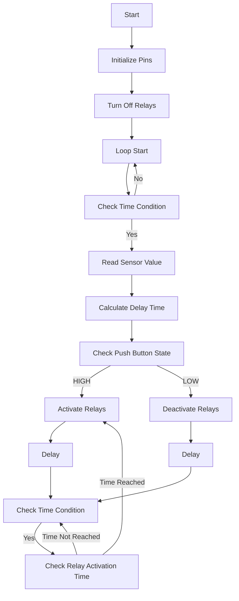

# Explanation 

## Description
This code controls four relays based on the input from an analog sensor and the state of a push button. The relays are used to control external devices connected to the corresponding pins on the microcontroller. The behavior of the relays is determined by the analog sensor value and the state of the push button.

## Hardware Setup
The code assumes the following hardware setup:

| Pin Name  | Pin Number | Description              |
|-----------|------------|--------------------------|
| Relay1    | 2/D2       | Control for Relay 1      |
| Relay2    | 14/D5      | Control for Relay 2      |
| Relay3    | 12/D6      | Control for Relay 3      |
| Relay4    | 13/D7      | Control for Relay 4      |
| push      | 15/D8      | Push Button Input        |
| analogPin | A0         | Analog Sensor Input (A0) |

Ensure that the hardware connections match the pin assignments defined in the code.

## Code Explanation
### Variable Definitions
- `sensorValue`: Stores the current reading from the analog sensor (A0 pin).
- `deltime`: Represents the delay time for each relay, calculated based on the sensor value.

### Pin Definitions
The following pins are defined for the relays and the push button:
- `Relay1`: Pin D4 (Digital pin 2)
- `Relay2`: Pin D5 (Digital pin 14)
- `Relay3`: Pin D6 (Digital pin 12)
- `Relay4`: Pin D7 (Digital pin 13)
- `push`: Pin D8 (Digital pin 15)

### Initialization
In the `setup()` function:
- The pin modes for the relays and push button are set. The relay pins are set as outputs, and the push button pin is set as an input.
- The relays are initially turned off by setting their corresponding pins to `HIGH`.

### Main Loop
In the `loop()` function:
- The code checks if the elapsed time since the last iteration is equal to or greater than `interval1` (100 milliseconds in this case).
- If the time condition is met, it reads the analog value from the sensor using `analogRead(A0)` and maps it to a delay time (`deltime`) between 1 and 255 multiplied by 15.
- It then checks the state of the push button using `digitalRead(push)`.
- If the push button is pressed (HIGH), it sequentially activates the relays with delays based on `deltime`.
- If the push button is not pressed (LOW), it sequentially deactivates the relays with delays based on `deltime`.
- The current time is stored in `currentMillis` for each relay activation or deactivation.
- The previous time is updated with the current time (`previousMillis = millis()`) to keep track of the interval.

## Flowchart

## Picture 

## Usage and Customization
To use this code, upload it to your microcontroller (e.g., Arduino) using the appropriate software. Ensure that the hardware connections are correct.

You can customize the code based on your requirements. Here are a few possible modifications:

- Adjust the pin assignments if you have connected the relays or push button to different pins on your microcontroller.
- Change the `interval1` value to adjust the delay between iterations of the main loop.
- Modify the mapping of `sensorValue` to `deltime` to suit your desired delay range.
- Add or remove relay control logic based on the number of relays you have connected.
- Implement additional actions or conditions based on the relay states or sensor values.

Make sure to test and validate any modifications to ensure the desired functionality.

## Troubleshooting
If the code is not working as expected, consider the following troubleshooting steps:

- Verify that the hardware connections are correct and match the pin assignments in the code.
- Check the power supply to ensure it is providing sufficient voltage

 and current for the relays and the microcontroller.
- Ensure that the relays are properly wired and can handle the load you are connecting to them.
- Confirm that the analog sensor is functioning correctly and providing valid readings.
- Check for any error messages or warnings during compilation or upload.

If issues persist, consult the documentation or support resources for your specific microcontroller and components.

## Disclaimer
This code and the associated instructions are provided as-is, without any warranty or guarantee. It is your responsibility to ensure the proper setup, testing, and safe operation of the hardware and software.
