# Relay Control with Push Button and Analog Sensor

This Arduino sketch provides a code example for controlling four relays based on input from a push button and an analog sensor. The code is written in C++ and is designed to run on an Arduino board.

## Table of Contents

- [Introduction](#introduction)
- [Hardware Components](#hardware-components)
- [Installation](#installation)
- [Usage](#usage)
- [Code Explanation](#code-explanation)
- [Flowchart](#flowchart)
- [Contributing](#contributing)
- [License](#license)

## Introduction

This code allows you to control four relays using an Arduino board. The relays can be activated or deactivated based on the input from a push button and an analog sensor connected to the board.

## Hardware Components

To use this code, you will need the following hardware components:

- Arduino board (e.g., Arduino Uno)
- Four-channel relay module
- Push button
- Analog sensor (e.g., potentiometer)
- Jumper wires
- Power supply for the relay module (if required)

## Installation

1. Connect the hardware components as follows:

   - Connect the relay module to the Arduino board using jumper wires. Connect each relay input to the corresponding Arduino pin (Relay1 to D4, Relay2 to D5, Relay3 to D6, Relay4 to D7).

   - Connect the push button to the Arduino board. Connect one leg of the button to ground (GND) and the other leg to D8 (push).

   - Connect the analog sensor (e.g., potentiometer) to the Arduino board. Connect one leg to 5V, the middle leg to A0 (analog input), and the other leg to ground (GND).

   - Ensure the relay module has an external power supply if required. Some relay modules need a separate power supply to operate the relays.

2. Install the Arduino IDE on your computer if you haven't already.

3. Open the Arduino IDE, create a new sketch, and copy the provided code into the sketch.

4. Upload the sketch to your Arduino board.

## Usage

1. After uploading the code to your Arduino board, power on the board.

2. Observe the behavior of the relays based on the input from the push button and analog sensor.

3. Press the push button to activate the relays. The relays will turn on sequentially based on the analog sensor value.

4. Release the push button to deactivate the relays. The relays will turn off sequentially.

## Code Explanation

The code is designed to control the relays based on the analog sensor value and the push button state. Here's a brief explanation of the code's functionality:

- It initializes the relays and sets them to the HIGH (off) state initially.

- It reads the analog sensor value from A0 and maps it to a delay time that controls the relay activation sequence.

- When the push button is pressed (HIGH state), it activates the relays one by one based on the delay time.

- When the push button is released (LOW state), it deactivates the relays one by one.

- The code uses millis() for timing to avoid blocking the loop.

## Flowchat

```mermaid
graph TD

style Initialization fill:#ffab91,stroke:#e64a19,stroke-width:3px;
style Setup fill:#ffc107,stroke:#ff9800,\,stroke-width:3px;
style Main-Loop fill:#81c784,stroke:#43a047,stroke-width:3px;
style Push-Button-Pressed fill:#64b5f6,stroke:#1976d2,stroke-width:3px;
style Push-Button-Released fill:#e57373,stroke:#c62828,stroke-width:3px;

subgraph Initialization
  A[Start]
  A --> B[Define Relay Pins ]
  B --> C[Define Push Button Pin ]
  C --> D[Initialize Variables as sensorValue, deltime, previousMillis, currentMillis ]
  D --> E[Set Interval Values as interval1, interval2]
end

subgraph Setup
  E --> F[Set Relay Pins as OUTPUT]
  F --> G[Set Initial Relay States ]
  G --> H[End Setup]
end

subgraph Main-Loop
  H --> I[Check Time Interval 1]
  I --> J[Read Analog Sensor A0]
  J --> K[Map Sensor Value to Delay Time]
  K --> L[Update previousMillis]
  L --> M[Check Push Button State]
end

subgraph Push-Button-Pressed
  M -- Yes --> N[Check Delay Time 1]
  N --> O[Activate Relay 1]
  O --> P[Check Delay Time 2]
  P --> Q[Activate Relay 2]
  Q --> R[Check Delay Time 3]
  R --> S[Activate Relay 3]
  S --> T[Check Delay Time 4]
  T --> U[Activate Relay 4]
  U --> V[End Push Button Pressed]
  M -- No --> V
end

subgraph Push-Button-Released
  V -- Yes --> W[Check Delay Time 1]
  W --> X[Deactivate Relay 1]
  X --> Y[Check Delay Time 2]
  Y --> Z[Deactivate Relay 2]
  Z --> AA[Check Delay Time 3]
  AA --> AB[Deactivate Relay 3]
  AB --> AC[Check Delay Time 4]
  AC --> AD[Deactivate Relay 4]
  AD --> AE[End Push Button Released]
  V -- No --> AE
end

I --> AE[End Main Loop]
AE --> I
```

## Contributing

Contributions to this project are welcome. If you have improvements or additional features to suggest, please feel free to open an issue or submit a pull request.

## License

This project is licensed under the MIT License - see the [LICENSE](LICENSE) file for details.
